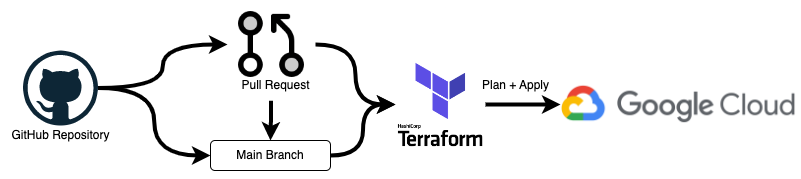

# Automating the deployment of Infrastructure

The is an example for deploying GCE ( Google Compute Engine ) instance on GCP using Github Actions.

- GCE instance is deployed using Github Actions
- Remote state handling using GCS (Google Cloud Storage) bucket

## Main Components



1. Terraform: IaC for creating cloud resources
2. GCP: Cloud provider
3. Github Actions: automated CI/CD pipeline for deploying applications and infrastructure

The workflow is triggered on push events to the `main` branch, pull requests, or manual workflow dispatches.

## Project Structure

The project structure should be like this:

```bash
IaC_automation
└── .github/workflows
    └── terraform.yaml      # defines the automated workflow, edit this file for your own use-case
└── environments
    └── dev
        ├── backends.tf     # defines the backend for storing Terraform state
        ├── main.tf         # defines the main configuration for creating GCE instance
        ├── networking.tf   # defines the newtworking related things: VPC, Subnets, Firewalls, etc
        ├── outputs.tf      # defines the outputs to be shared from Terraform remote state
        ├── providers.tf    # defines the GCP as the provider
        ├── storage.tf      # defines cloud-buckets to be used: Terraform remote-state, general cloud buckets
        ├── variables.tf    # defines input variables used in Terraform configuration
        └── versions.tf     # defines the required Terraform version
└── scripts
    └── create_gcp_service_account.sh # create a new GCP service account locally to be used for Terraform
    └── create_project_structure.sh   # Optional: recreate the project-structure
└── env.sample                        # sample ENV variables to be used
└── env                               # ENV variables to be used
```

## Workflow

This workflow contains several jobs and steps to enforce code quality and deployment of the infrastructure.

1. **Checkout**: Retrieves the repository’s contents to the runner.

2. **Setup Terraform**: Configures the runner with a specific version of Terraform (1.4.2 in this case).

3. **Terraform Format**: Ensures your Terraform code adheres to the expected format and style.

4. **Terraform Init**: Initializes your Terraform working directory, setting up backend storage and downloading required     provider plugins.

5. **Terraform Validate**: Validates the Terraform configuration for syntax and internal consistency.

6. **Terraform Plan**: Generates an execution plan detailing the changes that will be made to your infrastructure. This step is only executed on pull requests.

7. **Update Pull Request**: Adds a comment to the pull request with the outcomes of the format, initialization, validation, and plan steps, along with the detailed execution plan. This step is only executed on pull requests.

8. **Terraform Plan Status**: Exits the workflow with an error if the plan step fails.

9. **Terraform Apply**: Applies the Terraform plan to create, update, or delete infrastructure resources. This step is executed only when pushing to the main branch or triggering a manual workflow dispatch.

## How to run

1. Setup the environment

    1. GCP account: [Check](https://cloud.google.com/?hl=en)
    2. Active GCP account with billling enabled
    3. Install [Terraform](https://developer.hashicorp.com/terraform)
    4. Install Google Cloud SDK: [Check](https://cloud.google.com/sdk?hl=en)
    5. Github Repository

    ```bash
    # Check Google Cloud SDK
    gcloud --version
    gcloud init 
    gcloud auth login # login using your default account

    # Verify Terraform
    terraform --version

    # Check your active project
    gcloud config get-value project
    ```

2. Create a GCP service account

    - This creates a service account to be used during CI/CD pipeline (Github Action): `terraform-sa-key.json`

    ```bash
    cd scripts/
    bash create_gcp_service_account.sh
    ```

3. Create the basic projcet structure and add it to the Github repository

    - Create a github repository and add the project structure
    - Update the `.env` file

    ```bash
    cd scripts/
    bash create_project_structure.sh
    ```

4. Set the `ENV` variables in `Github` to trigger the workflow:
    - `TF_ENVIRONMENT`: set environment name to be used: `dev` or `prod` ( currently we only have the dev )
    - `TF_VAR_GCP_CREDENTIALS`: GCP service account JSON key
    - `GITHUB_TOKEN`: Your Github account's access token

5. Trigger the workflow

    1. Make some changes in the repository: 
        - add, change or remove cloud resources from terraform files

    2. Create a pull request to the `main` branch:
        - this triggers the github actions workflow to run on your pull request

    3. Monitor the deployment process:
        - Watch the "Actions" tab of the Github

    4. Review the pull request:
        - this will summarize the outcomes of the workflow and provides the detailed execution plan
        - review this plan

    5. Merge the pull request:
        - if everything is okay, merge the pull request to trigger the workflow agian
        - at this moment, **Terraform Apply** step is executed to deploy the infrastructure changes

    6. Verify the deployment on GCP:
        - Login to your GCP account and see the console for specific resources.