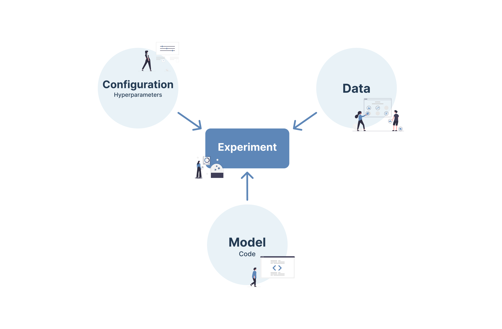

# Setting up MLFlow in GCP

MLFlow is a versioning tool for managing and tracking of ML related experiments.



Here are the steps to set up MLFlow in GCP:

1. Create a PostgreSQL DB for storing model metadata
2. Create a GCP bucket ( Cloud Storage Bucket ) for storing artifacts
3. Create a Compute Engine instance to install MLFlow and run the MLFlow server
4. SSH into VM instance and run the following command

```bash

# Create an env
sudo apt update
python3 -m venv env && source env/bin/activate

# Run MLFlow

mlflow server -h 0.0.0.0 -p 5000 --backend-store-uri postgresql://DB_PASSWORD@DB_ENDPOINT:5432/DB_NAME --default-artifact-root gs://GS_BUCKET_NAME
```

```bash
# To create/update resources:
./create_resources.sh create
./create_resources.sh destroy
```