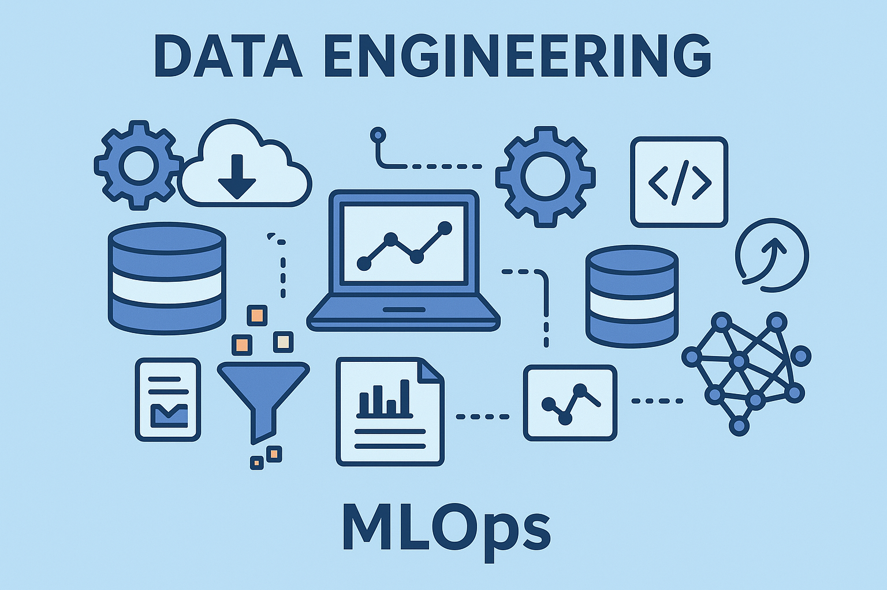

# Data-Engineering

Learning and Implementing data pipelines

## MLOps

- [MLFlow](/MLOps/MLFlow/README.md): For managing Exeperimental Tracking
- [Deploying APIs](/MLOps/Deploying_API/README.md): For Deploying APIs to the Cloud
- [Basic Terraform Project Structure For GCP](/MLOps/Cloud/GCP/basic_terraform_project_structure/README.md): For Setting up a basic Terraform Project
- [Automating the deployment of Infrastructure with GCP](/MLOps/Cloud/GCP/IaC_automation/README.md): For Deployging GCP resources with Terraform and Github Actions

## Tools

- [Terraform](/tools/terraform/README.md): For Infrastructure as a Code

## Pipelines